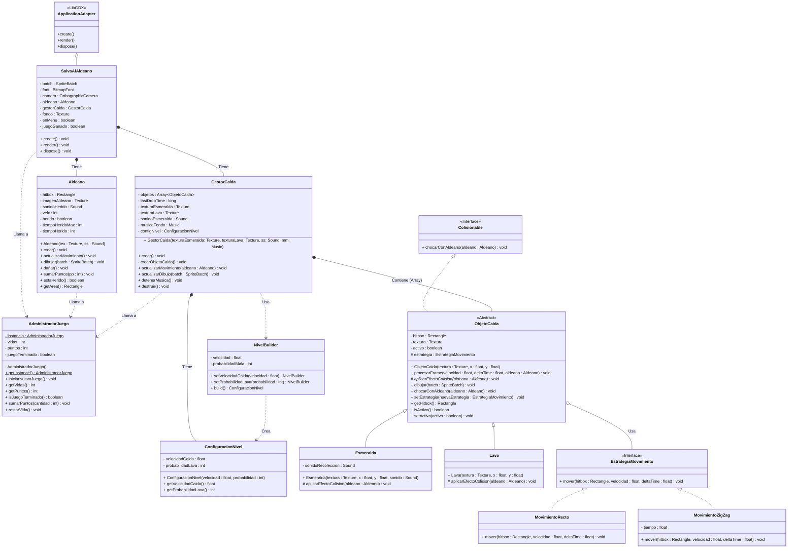

# Minecraft: Evade la Lava (GameLluvia-Java)

¡Bienvenido a **Minecraft: Evade la Lava**! Este es un videojuego arcade interactivo en 2D desarrollado en **Java** utilizando el framework **LibGDX**. 

El proyecto consiste en una versión completamente reimplementada y tematizada del clásico juego de atrapar gotas, adaptada con mecánicas, lógica avanzada de colisiones, polifonía de audio y la estética visual de Minecraft.

##  Mecánicas del Juego

* **Objetivo:** Controlas a un Aldeano que debe recolectar esmeraldas que caen del cielo para acumular puntos mientras evita los bloques de lava ardiente.
* **Condición de Victoria:** Lograr salvar al aldeano alcanzando una meta estricta de **1100 puntos**.
* **Condición de Derrota:** Perder las 3 vidas disponibles al ser alcanzado por la lava.
* **Dificultad Progresiva:** La velocidad de caída de los objetos aumenta dinámicamente con cada punto obtenido, generando una curva de desafío fluida.

---

##  Controles

* **Flecha Izquierda / Derecha:** Mover al aldeano.
* **Barra Espaciadora:** Iniciar el juego desde el menú principal.
* **ENTER:** Reiniciar la partida desde las pantallas de Victoria o Game Over.
* **ESCAPE:** Volver al menú principal en cualquier momento de fin de juego.

---

##  Patrones de Diseño Implementados

Para garantizar un código limpio, desacoplado y escalable siguiendo las buenas prácticas de la ingeniería de software, se utilizaron los siguientes patrones arquitectónicos:

1.  **Singleton (`AdministradorJuego`):** Garantiza una única instancia global para controlar el estado del juego, el puntaje actual, el control de vidas y las transiciones entre pantallas (Menú, Juego Activo, Victoria, Game Over).
    
2.  **Builder (`NivelBuilder` / `ConfiguracionNivel`):** Permite instanciar y parametrizar las configuraciones iniciales del nivel (velocidad base, tasas de aparición) de manera limpia, legible y altamente mutable mediante encadenamiento de métodos.

3.  **Strategy (`EstrategiaMovimiento` / `MovimientoZigZag`):** Desacopla el comportamiento del movimiento de los objetos que caen. Permite inyectar algoritmos de movimiento dinámicos en tiempo de ejecución (por ejemplo, el patrón de caída en zigzag de la lava).

4.  **Template Method (`ObjetoCaida` / `Esmeralda` / `Lava`):** Define el esqueleto algorítmico del ciclo de vida de un frame (`procesarFrame`) en la clase abstracta padre, delegando los efectos específicos de la colisión física y sonora a las subclases correspondientes.

---

##  Características Técnicas Destacadas

* **Optimización del Spawneo (Hitbox Fantasma):** Implementación de una validación predictiva mediante un objeto `Rectangle` temporal y ligero antes de instanciar elementos pesados en memoria. Evita la superposición física de entidades en el área de nacimiento superior.
* **Lógica de Estados Circular:** Arquitectura de estados fluida controlada por teclado que permite reiniciar de manera inmediata la partida o navegar en ciclos continuos de regreso al menú principal de forma segura utilizando variables lógicas (booleanos).
* **Polifonía y Audio Limpio:** Configuración avanzada de canales que permite la superposición nativa de efectos de sonido (Efecto *Trade* del Aldeano) sin cortes abruptos ni saturación de ondas en el buffer.

---

##  Requisitos e Instalación

### Prerrequisitos
* **Java JDK 11** o superior.
* **Eclipse IDE** (o cualquier entorno compatible con Gradle).

### Ejecución
1. Importar el proyecto en Eclipse como un proyecto Gradle existente.
2. Sincronizar las dependencias de LibGDX.
3. Ejecutar la clase principal de la carpeta `desktop` (DesktopLauncher) como aplicación Java (`Run As -> Java Application`).

---

##  Equipo de Desarrollo

* **Alexis Escobar:** Desarrollo de código, refactorización y lógica de patrones de diseño.
* **Yael Astorga:** Documentación, informes y elaboración de diagramas UML.
* **Benjamin Estay:** Documentación, informes y estructuración de requerimientos.

## UML

